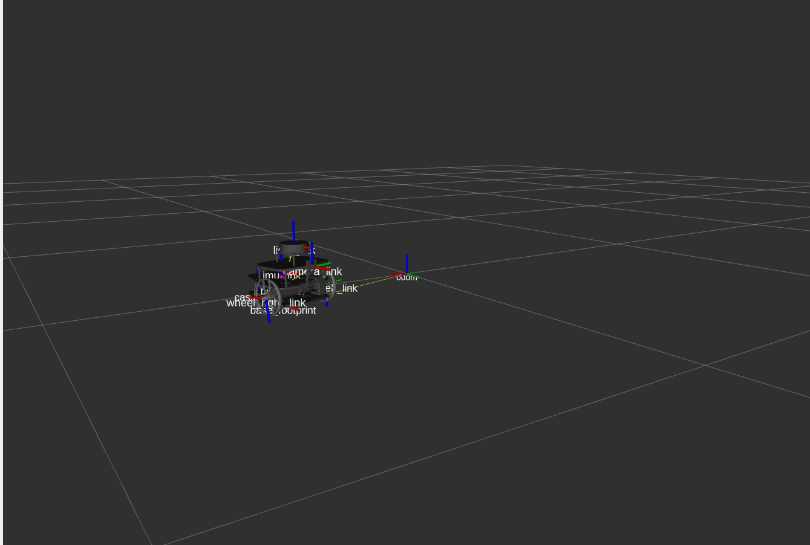
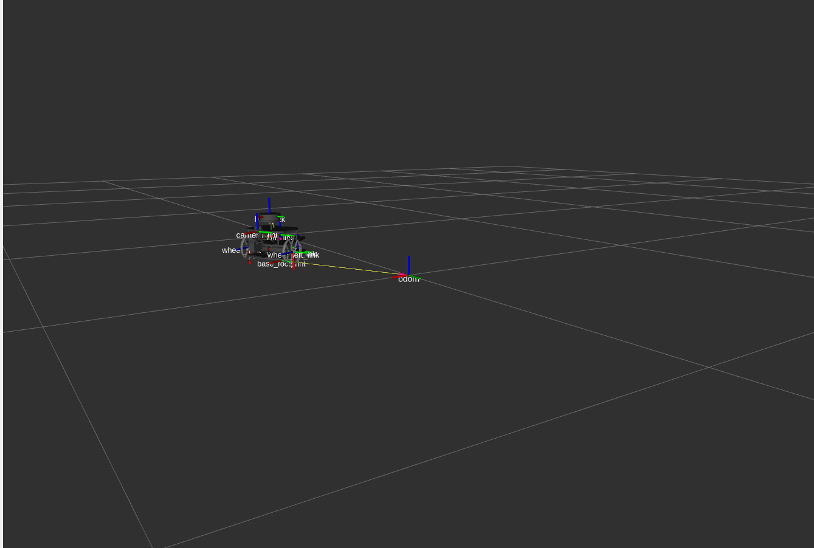

# Puzzlebot-Challenge-
This repository is for the implementation of the class "Integración de robótica y sistemas inteligentes" at Tecnologico de Monterrey

## Week 1 — Robot Visualization in RViz

Spawns the MCR2 Puzzlebot (Jetson + Lidar edition) in RViz. The robot automatically moves in a circle around the origin while the wheels spin.

### Requirements

Make sure the workspace is built and sourced:

```bash
git clone https://github.com/Hugo734/Puzzlebot-Challenge-.git
cd Puzzlebot-Challenge-
colcon build --packages-select puzzlebot_description
source install/setup.bash
```

### Demo

 

### Launch

```bash
ros2 launch puzzlebot_description week1.launch.py
```

### What it runs

| Node | Description |
|---|---|
| `robot_state_publisher` | Loads the URDF and publishes the robot TF tree |
| `circular_motion.py` | Moves the robot in a circle (radius 0.5 m) and spins the wheels |
| `rviz2` | Visualizes the robot with `odom` as the fixed frame |

### Tuning the motion

Edit `scripts/circular_motion.py` and adjust the parameters at the top of `__init__`:

```python
self.radius = 0.5   # circle radius in metres
self.omega  = 0.5   # angular velocity in rad/s
```

Rebuild after any change:

```bash
colcon build --packages-select puzzlebot_description && source install/setup.bash
```
